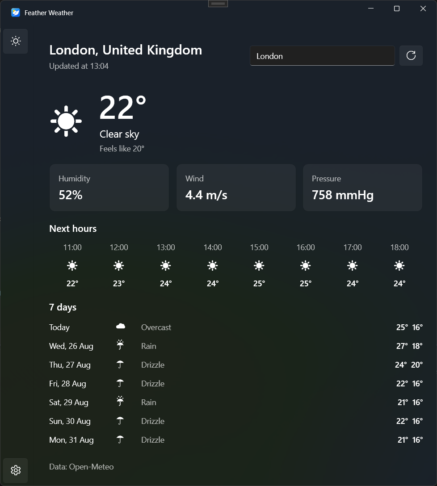

# Feather Weather

Feather Weather is a small, lightweight weather app for Windows built with WPF. It is designed for fast startup and a low memory footprint without sacrificing the essentials of a desktop forecast.

## Screenshots


## Features

- Search for weather by city name
- Current temperature, apparent temperature, humidity, wind speed, and pressure
- Forecast for the next 8 hours
- 7-day forecast with daily high and low temperatures
- English, Russian, German, French, Spanish, Italian, Portuguese, Dutch, Polish, and Ukrainian localizations
- System, light, and dark theme options
- Settings and weather views with lightweight navigation
- Immediate display of the last successful forecast from a local cache
- Manual refresh with request cancellation
- Single-instance behavior that activates the existing window when the app is launched again

Weather and geocoding data are provided by [Open-Meteo](https://open-meteo.com/). No API key is required.

## Technology

- .NET 10 and WPF
- Built-in WPF Fluent theme (`ThemeMode="System"`)
- Open-Meteo Forecast and Geocoding APIs
- `System.Text.Json` source generation
- `CommunityToolkit.Mvvm` for observable state and commands
- `Microsoft.Extensions.DependencyInjection` for application services
- No Generic Host, WebView, or charting library

## Requirements

- Windows 10 or later
- [.NET 10 SDK](https://dotnet.microsoft.com/download/dotnet/10.0), or Visual Studio with the **.NET desktop development** workload
- An internet connection for retrieving fresh weather data

## Run locally

From the repository root:

```powershell
dotnet run --project .\FeatherWeather\FeatherWeather.csproj -c Release
```

The default city is Saint Petersburg. Enter another city and press **Enter** or use the refresh button to load its forecast. Language and appearance can be changed from the settings view.

## Build

```powershell
dotnet build .\FeatherWeather.sln -c Release
```

## Publish

For a framework-dependent, 64-bit Windows build:

```powershell
dotnet publish .\FeatherWeather\FeatherWeather.csproj -c Release -r win-x64 --self-contained false
```

The published files are written under `FeatherWeather\bin\Release\net10.0-windows\win-x64\publish\`.

The project intentionally keeps `PublishSingleFile` disabled. A regular framework-dependent build avoids bundling the runtime and lets Windows and .NET reuse shared components, which is a better fit for the application's startup and memory goals.

## Cache and startup behavior

Application data is stored under `%LOCALAPPDATA%\FeatherWeather`:

```text
weather.json    Last successful forecast
settings.json   Persisted language selection
```

On startup, settings and localization are initialized before the main window is shown. The cached forecast is then loaded and displayed when available, while a fresh request runs in the background. Cache and settings I/O is best-effort, so missing or invalid files do not prevent the application from running.

There are no background polling timers. Weather data is requested only at startup or when the user refreshes it.

## Performance choices

- One application-lifetime `HttpClient` is reused for all weather requests.
- Network access starts only after the window has rendered.
- JSON serialization metadata is generated at compile time.
- Release builds enable optimization, tiered compilation, tiered PGO, and ReadyToRun publishing.
- MVVM keeps presentation state out of the views, while minimal code-behind handles window-specific behavior.
- The settings view is created only when it is first opened.

## Measuring memory usage

For useful comparisons, run a Release build, wait for the forecast to load, minimize and restore the window, and then leave it idle for 20–30 seconds.

```powershell
$process = Get-Process FeatherWeather
$process | Select-Object ProcessName,
    @{N='WorkingSetMB';E={[math]::Round($_.WorkingSet64 / 1MB, 1)}},
    @{N='PrivateMB';E={[math]::Round($_.PrivateMemorySize64 / 1MB, 1)}}
```

`PrivateMemorySize64` is generally the more useful primary footprint measurement; treat the working set as an additional data point.

## Possible future improvements

- Optional city detection through the Windows Location API
- System tray support
- Compact window mode
- Short-term precipitation forecast
- On-demand UV index and air quality data
